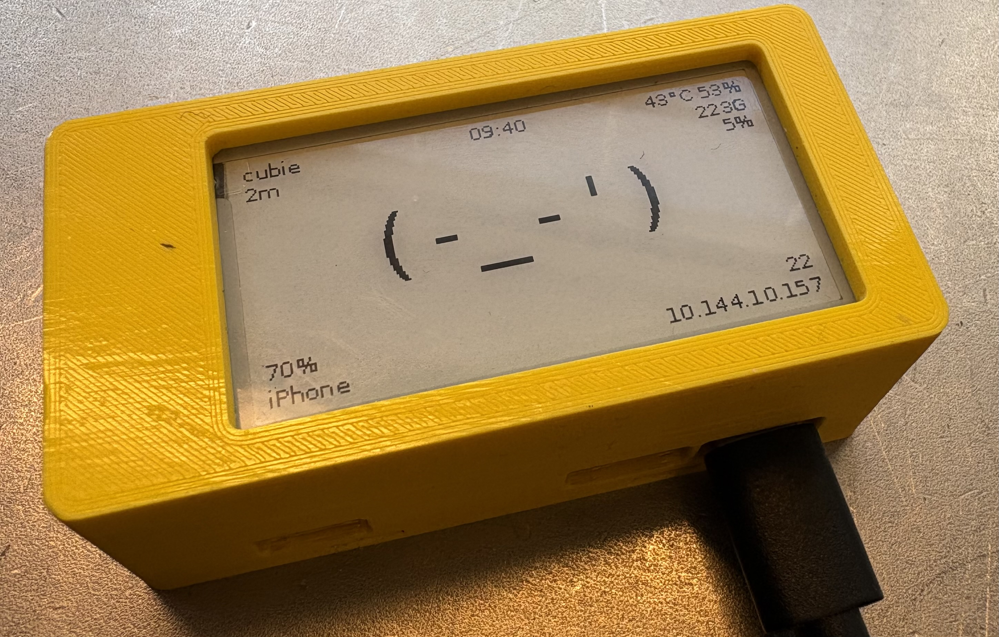
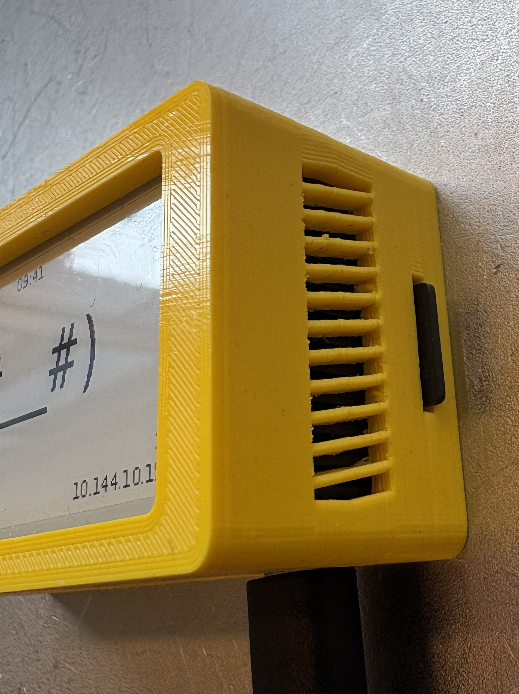
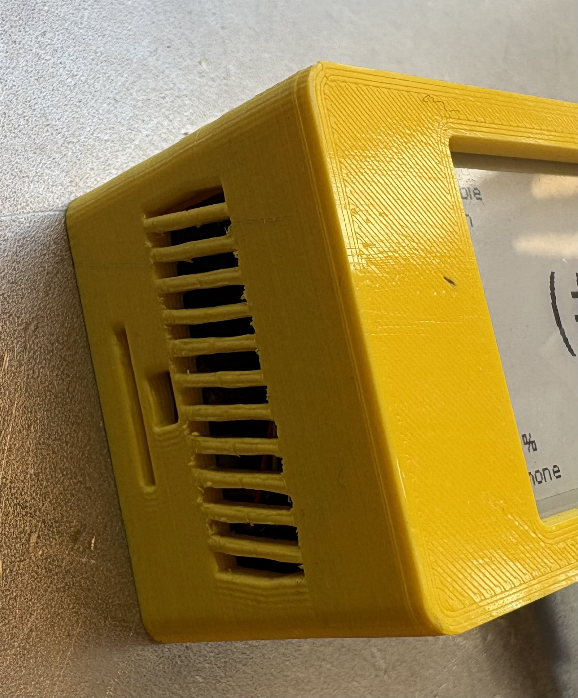
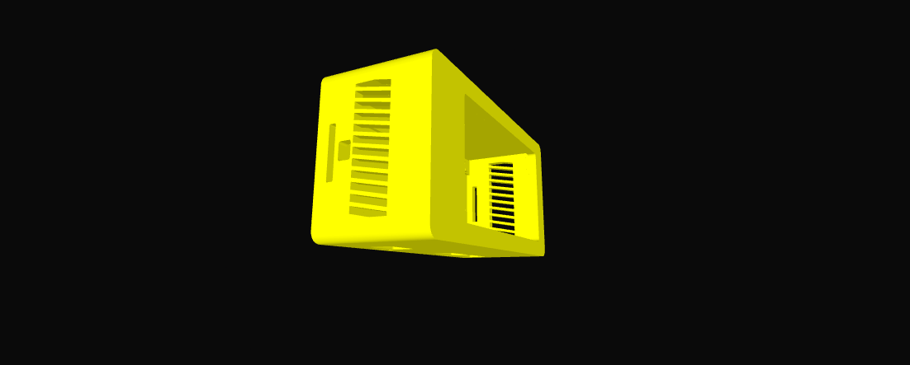
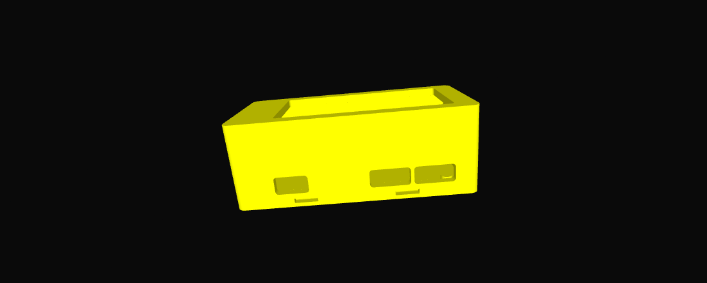
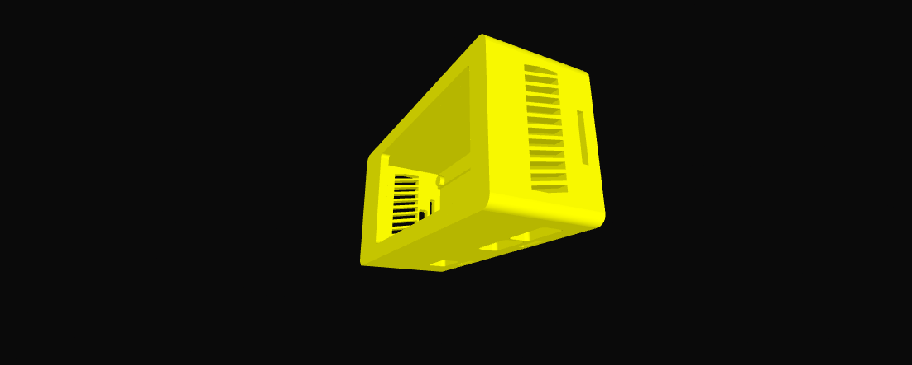

# Cubie A7Z enclosure print files

This directory contains the CAD source, exchange model, print-ready 3MF files, screenshots, and real photos for the Cubie A7Z enclosure.

  

  
  

## Files

| File | Purpose |
| --- | --- |
| `cubiea7z.f3d` | Fusion 360 source file for editing the enclosure. |
| `cubiea7z.step` | Neutral CAD exchange file for inspection, remixing, or importing into other CAD tools. |
| `cubie-top.3mf` | Print-ready 3MF for the top/main enclosure body. |
| `cubie-lid.3mf` | Print-ready 3MF for the lid. |
| `screenshots/` | CAD/render screenshots showing the enclosure shape and cutouts. |
| `photos/` | Photos of the printed enclosure details. |

## Online model viewing

For a quick browser-based look at the model, open [`cubiea7z.step`](cubiea7z.step) with an online STEP viewer such as [3DViewer.net](https://3dviewer.net/).

## Design features

- Ventilation holes aligned for the Cubie A7Z with the vendor stock cooling/fan installed.
- Camera cutout.
- Antenna cutout.
- SD card cutout.
- HDMI and USB cutouts.

## CAD screenshots

  
  
  

## Notes

The compiled print files are kept alongside the editable CAD files so the known-good print artifacts are available without needing to rebuild/export from Fusion first.
